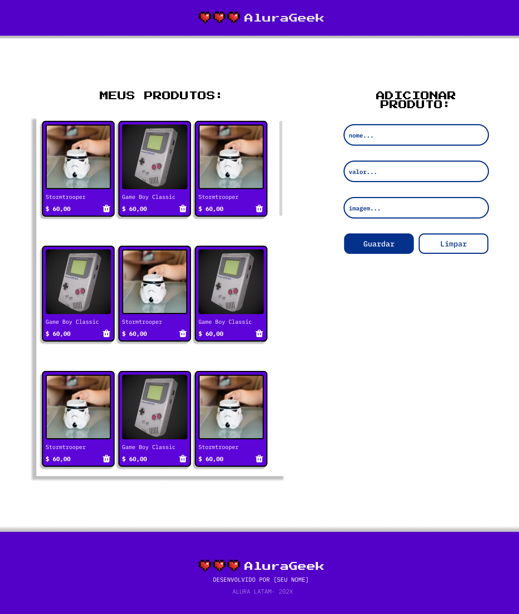

# New-AluraGeek-Challege

    <h1>Challenge AluraGeek - 2024.</h1>

## Este é o repositório base do nosso projeto, nele voce encontrará uma página  HTML estrutura simples, um arquivo de estilos CSS e um de código Javascript.

- Onde podemos fazer um CRUD(Create, Read, Update, Delete Editar) simples usando JavaScript puro.  

- Com arquivo estlio json junto com main.js junto e local

- Onde você pode  ver o projeto: [aqui](https://pedrozef.github.io/new-AluraGeek-Challege/)

## Sobre o desafio utilizamos:
- HTML
- CSS
- Javascript
- GitHub
  

    
    
      
    

  

## Designer do Figma:
  

    

  

### Tempo na Execução do Projeto:

    
    

